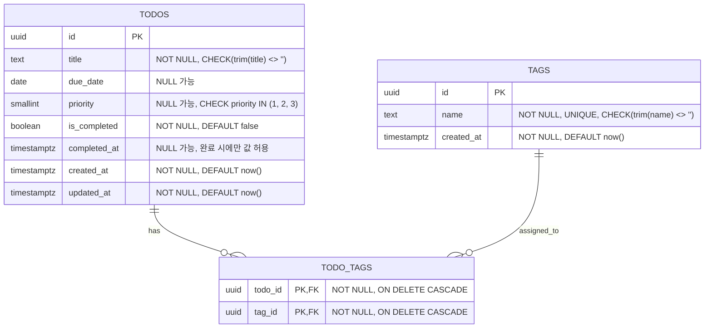

# Todolist App ERD

PRD의 기능 요구사항을 기준으로 한 최소 ERD다.  
초기 버전은 개인용, 비로그인, 로컬 저장 중심이므로 인증 테이블은 두지 않는다.  
이 문서는 PostgreSQL 기준의 논리 모델이며, 실제 초기 구현의 localStorage/IndexedDB 저장은 애플리케이션 계층에서 처리한다.

## 1. Mermaid ERD

## 2. 테이블 역할

- `todos`: 사용자가 관리하는 할 일의 핵심 정보를 저장한다.
- `tags`: 여러 할 일에 재사용 가능한 태그 이름을 저장한다.
- `todo_tags`: 할 일과 태그의 다대다 관계를 저장한다.

## 3. 컬럼 설명

### `todos`

- `id` (`uuid`, `PRIMARY KEY`): 각 할 일을 고유하게 식별한다.
- `title` (`text`, `NOT NULL`, `CHECK(trim(title) <> '')`): 할 일 제목이다.
- `due_date` (`date`, `NULL 가능`): 마감일이며 날짜 단위 필터링에 사용한다.
- `priority` (`smallint`, `NULL 가능`, `CHECK (priority IN (1, 2, 3))`): 우선순위를 저장한다. `1=낮음`, `2=보통`, `3=높음`으로 사용한다.
- `is_completed` (`boolean`, `NOT NULL`, `DEFAULT false`): 완료 여부를 저장한다.
- `completed_at` (`timestamptz`, `NULL 가능`): 완료된 시각을 저장한다. `is_completed = true`일 때만 값이 있어야 한다.
- `created_at` (`timestamptz`, `NOT NULL`, `DEFAULT now()`): 생성 시각이다.
- `updated_at` (`timestamptz`, `NOT NULL`, `DEFAULT now()`): 마지막 수정 시각이다.
- `CHECK ((is_completed = true AND completed_at IS NOT NULL) OR (is_completed = false AND completed_at IS NULL))`로 완료 상태와 완료 시각의 일관성을 보장한다.

### `tags`

- `id` (`uuid`, `PRIMARY KEY`): 태그를 고유하게 식별한다.
- `name` (`text`, `NOT NULL`, `UNIQUE`, `CHECK(trim(name) <> '')`): 태그 이름이다. 중복 태그를 방지한다.
- `created_at` (`timestamptz`, `NOT NULL`, `DEFAULT now()`): 태그 생성 시각이다.

### `todo_tags`

- `todo_id` (`uuid`, `PRIMARY KEY`, `FOREIGN KEY`, `ON DELETE CASCADE`): 어떤 할 일에 연결되는지 저장한다.
- `tag_id` (`uuid`, `PRIMARY KEY`, `FOREIGN KEY`, `ON DELETE CASCADE`): 어떤 태그에 연결되는지 저장한다.
- `PRIMARY KEY (todo_id, tag_id)`로 동일한 태그 연결의 중복을 막는다.

## 4. 관계 설명

- `todos` 1:N `todo_tags`
  - 하나의 할 일은 여러 태그를 가질 수 있다.
  - 태그 필터링과 태그 추가/삭제를 유연하게 처리하려면 단일 컬럼이 아니라 연결 테이블이 필요하다.
  - `ON DELETE CASCADE`는 할 일 삭제 시 연결 데이터가 함께 정리되도록 한다.
- `tags` 1:N `todo_tags`
  - 하나의 태그는 여러 할 일에 재사용될 수 있다.
  - 같은 태그 문자열을 여러 번 저장하지 않기 위해 태그를 별도 테이블로 분리한다.
  - `ON DELETE CASCADE`는 태그 삭제 시 연결 데이터가 함께 정리되도록 한다.

## 5. 설계 판단

- `status` 테이블은 두지 않았다. 완료/미완료만 필요하므로 `is_completed boolean`이 가장 단순하다.
- `priority`도 별도 테이블 대신 `smallint CHECK`로 처리했다. 값이 고정되어 있고 확장 가능성보다 단순성이 중요하다.
- `categories`는 현재 PRD에 세부 사용 규칙이 없어 제외했다. 나중에 카테고리 요구가 확정되면 `categories`와 `todo_categories`를 추가하면 된다.
- 검색은 우선 `title` 기반 `ILIKE`로 처리한다. 태그명 검색이 필요해지면 `tags.name` 조인을 추가한다.
- 로컬 저장 자체는 ERD 범위 밖이며, 초기 구현에서는 `todos`, `tags`, `todo_tags`를 JSON 형태로 직렬화해 저장하는 방식으로 연결할 수 있다.

## 6. 인덱스 권장

- `todos(is_completed)`: 완료/미완료 필터를 빠르게 처리한다.
- `todos(due_date)`: 마감일 필터링과 정렬을 빠르게 처리한다.
- `todos(priority)`: 우선순위 정렬/필터링을 빠르게 처리한다.
- `todos(created_at)`: 최신순 정렬을 빠르게 처리한다.
- `todo_tags(tag_id)`: 태그 기준 필터링을 빠르게 처리한다.

## 7. 기능 적합성 점검

- 할 일 추가/수정/삭제: `todos`의 `title`, `due_date`, `priority`, `is_completed`, `completed_at`으로 지원한다.
- 완료/미완료 전환: `is_completed`와 `completed_at`으로 지원한다.
- 목록 조회/필터/정렬: `due_date`, `priority`, `is_completed`, `created_at`으로 지원한다.
- 태그 추가/수정/필터: `tags`와 `todo_tags`로 지원한다.
- 로그인/회원가입: PRD의 초기 범위가 아니므로 테이블을 두지 않는다.
